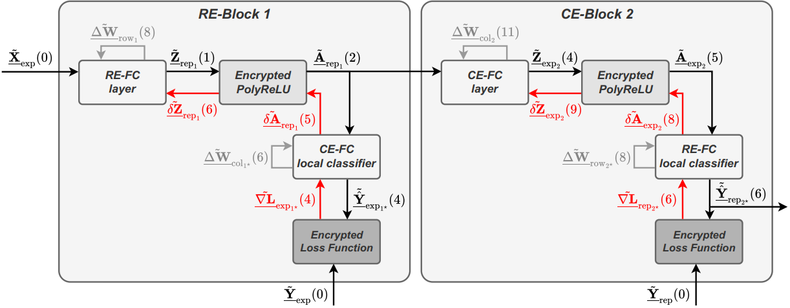

# ReBoot Digest

ReBoot is the first framework to enable fully encrypted and non-interactive training of Multi-Layer Perceptrons (MLPs) using CKKS bootstrapping.
ReBoot has been introduced in the paper: 
* _Pirillo & Colombo (2025)._ "[ReBoot: Encrypted Training of Deep Neural Networks with CKKS Bootstrapping](https://arxiv.org/abs/2506.19693)", 
[[direct PDF link](https://arxiv.org/abs/2506.19693)], [[local pdf](doc/pdf/Pirillo.Colombo--2025--ReBoot%3DEncrypted.training.of.DNN.withCKKS.bootstrapping.pdf)]
* this is a digested version of the original [ReBoot GitHub repository](https://github.com/albertopirillo/ReBoot)



* changes:
  * refactored build mechanism, removed containerization
  * added Python packaging 
  * added explanations


## Build 
* pull in openFHE as submodule
    ``` 
    git submodule update --init --recursive
    ```

* build the Python package for ReBuild (see [build doc](doc/build.md) for details)
  ```
  uv venv
  uv sync
  uv pip install -e . -v
  ```


* build _py-openfhe_
    ``` 
    uv pip install --python .venv/bin/python "pybind11>=2.12
    make py-openfhe
    ```
    > [!WARNING]
    > Do NOT call `uv sync` after this step.
    > It removes package `openfhe` as it is not declared (on purpose) in `pyproject.toml`.
    > See [doc/build.md](doc/build.md) for details.
    > Re-run `make py-openfhe` after every `uv sync`.
  


* test if `reboot` import works (must be in the virtual environment)
  ```
  source .venv/bin/activate
  
  python -c "import reboot"
  ```


* run sample MNIST experiment
  ```
  experiments/1_training_plain/run-sample-exp.sh
  ```

* run experiment training 
  ```
  experiments/3_training_encrypted/training_encrypted.sh
  ```


## Project structure 

``` 
ReBoot
├── build        # build artifacts - not checked into git
├── cpp          # all CPP code
├── doc          # documentation
├── experiments  # experiments for the publication
├── extern       # external dependencies/submodules 
└── py           # Python source code
```


## Authors of the original repository: 
- [Alberto Pirillo](https://github.com/albertopirillo): alberto.pirillo@mail.polimi.it
- [Luca Colombo](https://github.com/lucacolombo97): luca2.colombo@polimi.it

